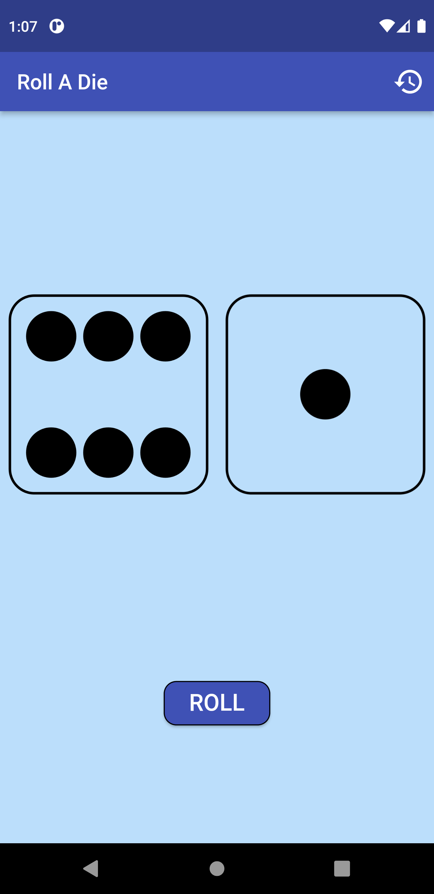
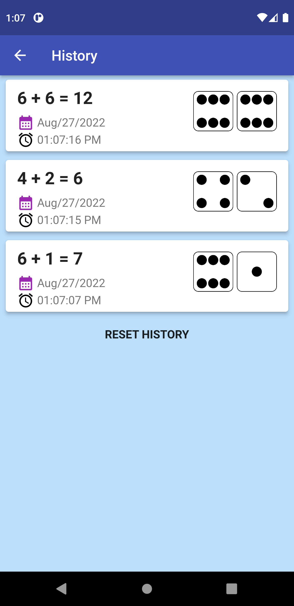
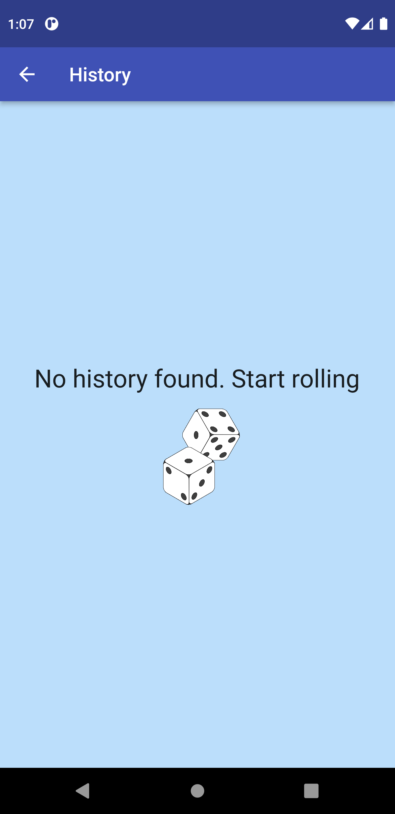
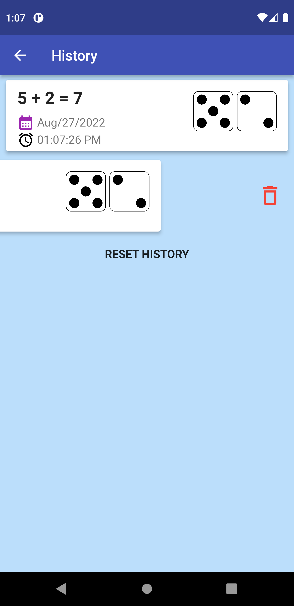

# MiFinity

# Dice Roller

This code repository is a submission for task assigned to me from MiFinity. 

## Description
The developed application contains two screen to which the route is managed using AutoRoute and the functionalities include:
1. Rolling two dicee and getting two random numbers. The random numbers generated between 1 and 6 updates the dice faces on the first screen and records the numbers along with a timestamp.
2. The dice are idle at the start. Shakes for one second when rolled and then die faces are updated.
2. History can be viewed on the second screen accessible from the history icon on the right corner of the app bar. Each instance of history contains a date, a time, a number that was generated. 
3. Entries in the history can be removed one by one by swiping an item left and dismissing it or the whole list can be cleared using the RESET HISTORY option provided at the bottom. 

## Sample Screenshots

## Main Page Idle

## Main Page Dice Rolled

## History Page with history

## Empty history page

## Removing an item from history list

## Sample Video
